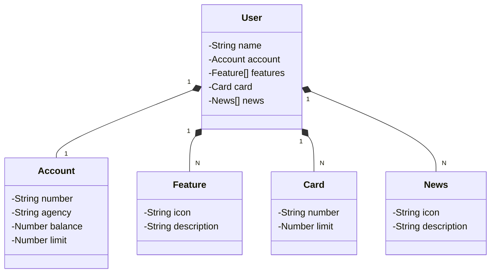

# Santander Dev Week 2023

Java RESTful API created for Santander Dev Week.

## Main Technologies
 - **Java 17**: Using the latest LTS version of Java to take advantage of the latest innovations that this robust and widely used language offers.
 - **Spring Boot 3**: Working with the newest version of Spring Boot, which maximizes developer productivity through its powerful auto-configuration premise.
 - **Spring Data JPA**: Exploring how this tool can simplify our data access layer, making it easier to integrate with SQL databases.
 - **OpenAPI (Swagger)**: Creatibng an effective and easy-to-understand API documentation using OpenAPI (Swagger), perfectly aligned with the high productivity that Spring Boot offers.
 - **Railway**: Simplifying the deployment and monitoring of our solutions in the cloud, as well as offering various databases as a service and CI/CD pipelines.

## [Link do Figma](https://www.figma.com/file/0ZsjwjsYlYd3timxqMWlbj/SANTANDER---Projeto-Web%2FMobile?type=design&node-id=1421%3A432&mode=design&t=6dPQuerScEQH0zAn-1)

Figma was used for the abstraction of this API's domain, being useful in the analysis and design of the solution.

## Class Diagram (API Domain)

## gigiocode